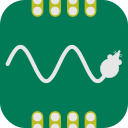
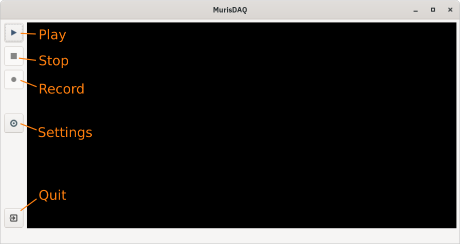
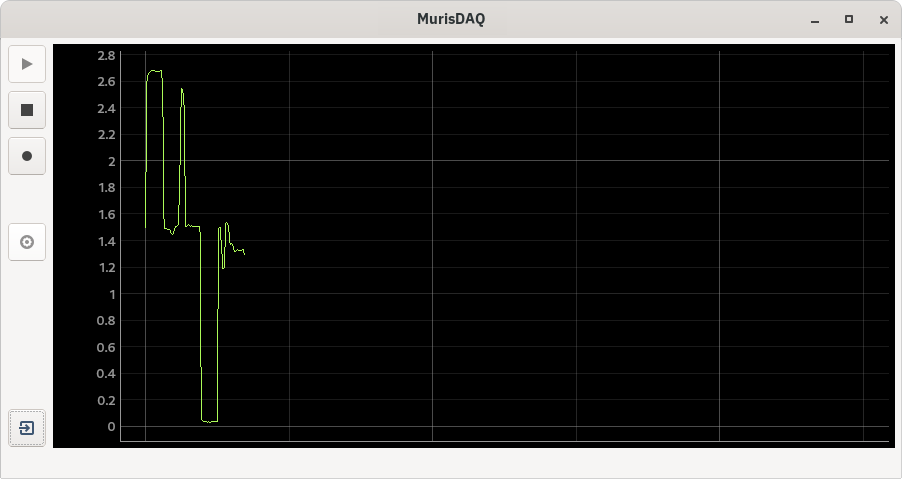
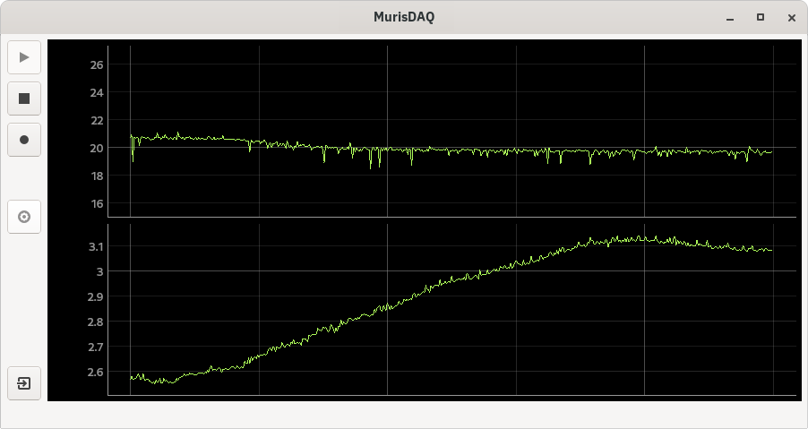
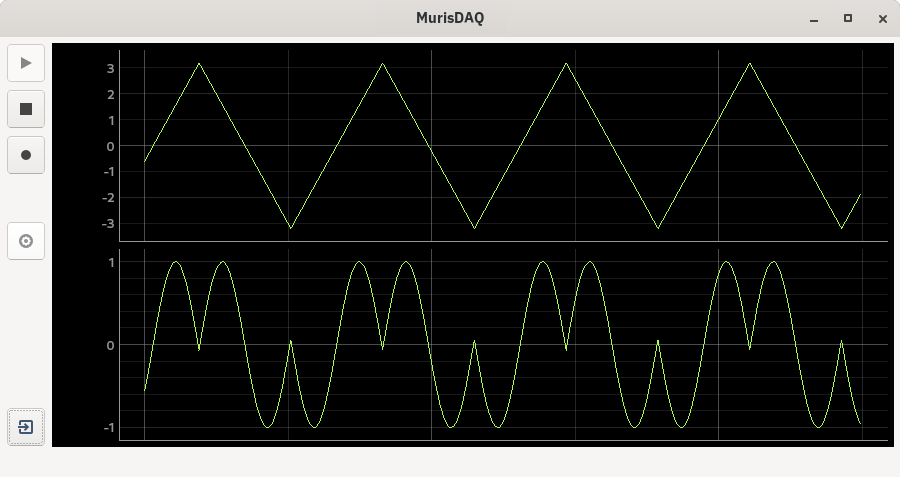
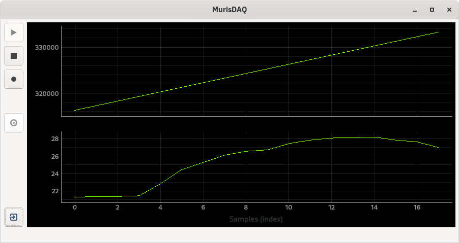
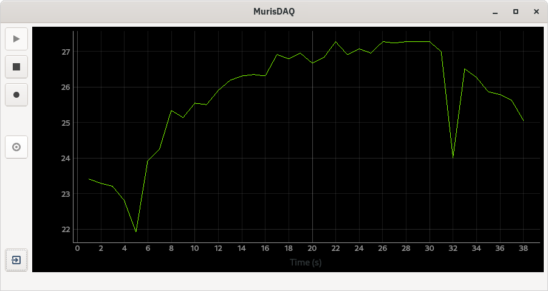
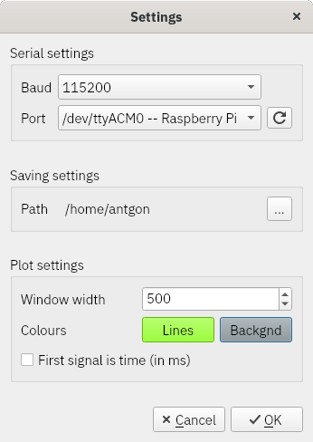

# murisdaq



Read and plot serial data from a microcontroller

**MurisDAQ** displays serial data in real time. It is intended as a
simple way to plot data from a microcontroller. It may not very
efficient in the way resources are used, as it just repeatedly reads
ascii from the serial port `print`ed line-by-line by the
microcontroller, but it helps to quickly evaluate
microcontroller-acquired data values with minimal effort.

<!-- #<p align="right"> -->
<!-- </p> -->

***

## Contents

1. [Requirements](#requirements)
1. [Usage](#usage)
    1. [Example 1: Plot data from Raspberry Pico in real time](#Example-1-Sample-analog-data-and-plot-in-real-time)
    1. [Example 2: Plot more than one signal](#Example-2-Plot-more-than-one-signal)
    1. [Example 3: Arduino example](#Example-3-Using-with-Arduino)
    1. [Example 4: Plot *y* vs *x*](#Example-4-Plotting-y-vs-x)
1. [Settings](#Settings)

***

## Requirements

* [PyQt6](https://www.riverbankcomputing.com/software/pyqt/)
* [NumPy](https://numpy.org/)
* [PyQtGraph](http://pyqtgraph.org/)
* [pySerial](https://github.com/pyserial/)


## Usage

1. Connect your microcontroller to the "master" computer. Set up the
   microcontroller to send data over the serial port (typically with
   `print` or `printf`; see examples below).

1. Run `python murisdaq.py` on the "master" computer.

1. Open [Settings](#settings) and set baud rate and port if necessary.

1. Click the "play" button to display the data.

1. Click the "record" button to save the data to the default
   directory (as set in the settings dialog). The file name will be made
   up of the current date and time. The file format will be plain text
   (space-separated if more than one column).



### Example 1: Sample analog data and plot in real time (Micropython)

A light-dependent resistor (aka photoresistor) was connected to a
**Raspberry Pico** (adc pin 26) in order to measure the relative
intensity of ambient light. The following micropython code was set to
read and print the measured voltage every 500 ms:

```python
from machine import ADC
import utime

conversion_factor = 3.3/(2**16-1)

# Light-dependent resistor
ldr = ADC(26)

while True:
    ldr_adc_val = ldr.read_u16()
    ldr_voltage = ldr_adc_val * conversion_factor
    print(ldr_voltage)
    utime.sleep_ms(500)
```

Running `python murisdaq.py` on the "master" computer and clicking the
"play" button shows in real time the data. In this example the y-axis
units are volts (as established in the micropython code above when adc
values are converted to voltage before printing).




### Example 2: Plot more than one signal

More that one signal can be plotted simultaneously by just setting the
microcontroller to print more than one value as needed. In this example,
one (analog) thermometer was connected to adc pin 28 on the same
**Raspberry Pico** as above. The micropython code is now:

```python
from machine import ADC
import utime

conversion_factor = 3.3/(2**16-1)

# Light-dependent resistor
ldr = ADC(26)

# Thermometer (TPM37, analog)
tmp37 = ADC(28)

while True:
    tmp37_adc_val = tmp37.read_u16()
    tmp37_voltage = tmp37_adc_val * conversion_factor
    tmp37_temperature = tmp37_voltage/0.02

    ldr_adc_val = ldr.read_u16()
    ldr_voltage = ldr_adc_val * conversion_factor

    print(tmp37_temperature, ldr_voltage)

    utime.sleep_ms(500)
```
**MurisDAQ** will detect and plot the two signals. In this figure, the
top trace is the ambient temperature (in degrees C) and the bottom trace
is the relative ambient light intensity (in volts):




### Example 3: Using with Arduino

To test on an Arduino, the following code was uploaded to an **Arduino
Uno** (using Arduino IDE). The Arduino generates two fake signals; these
values must be printed on the same line, separated by a space:
```c
void setup() {
  Serial.begin(9600);
}

float value = 0;
int direction = 1;
const float interval = 0.1;

void loop() {
  Serial.print(value);  // Print the first value
  Serial.print(' ');  // Print a space to separate the values
  Serial.println(sin(value));  // Print the second value and end the line
  value += (interval * direction);
  if ((value < -PI) | (value > PI)) {
    direction *= -1;
  }
  delay(50); // in ms
}
```
(This same code works for any other microcontroller that can be
programmed with the Arduino IDE, e.g. **Adafruit Feather**.)

After setting the correct baud rate and serial port in the settings
dialog **MurisDAQ** plots the two "signals" in real time:



### Example 4: Plotting *y* vs *x*

In all the examples above the data sampled lacks time information: the
*y* values are plotted against the index of the sample. To plot the
sampled values instead against time it is possible to set up the
microcontroller to `print` timer data and use this value in MurisDAQ. To
illustrate this, following from [Example
2](#example-2:-plot-more-than-one-signal) a thermometer was connected to
a **Raspberry Pico** (adc pin 28). With the micropython code below the
temperature is read every second and `print`ed to serial. This time,
however, timer information (ticks in milliseconds) are also `print`ed
(this must always be this first value in `print()`):

```python
from machine import ADC
import utime

conversion_factor = 3.3/(2**16-1)

# Thermometer (TPM37, analog)
tmp37 = ADC(28)

while True:
    now = utime.ticks_ms()
    tmp37_adc_val = tmp37.read_u16()
    tmp37_voltage = tmp37_adc_val * conversion_factor
    tmp37_temperature = tmp37_voltage/0.02

    print(now, tmp37_temperature)

    utime.sleep(1)
```
**MurisDAQ** will plot both sets of data -- timer (in ms) and
temperature (in deg C) -- as two signals:



But this is not what we want here: we want the first signal to be used
as *x* values. That is achieved by opening the Settings dialog and
checking *First signal is time* under [Plot settings](#plot-settings). Now the temperature is plotted against time:



### Settings



#### Serial settings

Select your microcontroller's baud rate and port. Pressing the port
refresh button will scan for devices connected ot the serial port. Thus,
you can connect/disconnect microcontrollers without having to restart
**MurisDAQ**.

#### Saving settings

This sets the directory where all data will be saved. The files will be
named according to their date and time of creation.

#### Plot settings

*Window width* sets the width of the plot in number of samples; i.e. a
window width of 500 means that the most recent 500 samples will be
displayed in real time. Values older than that are discarded from the
view.

*Line colour* opens a colour selection dialog to choose the colour of
the plotted curve(s).

*First signal is time*, if checked, the first signal in the data will
not be plotted. Instead, this will be taken to be *x* and thus used to
plot the rest of the data samples against these values; see [Example
4](#example-4-plotting-x-vs-y).
